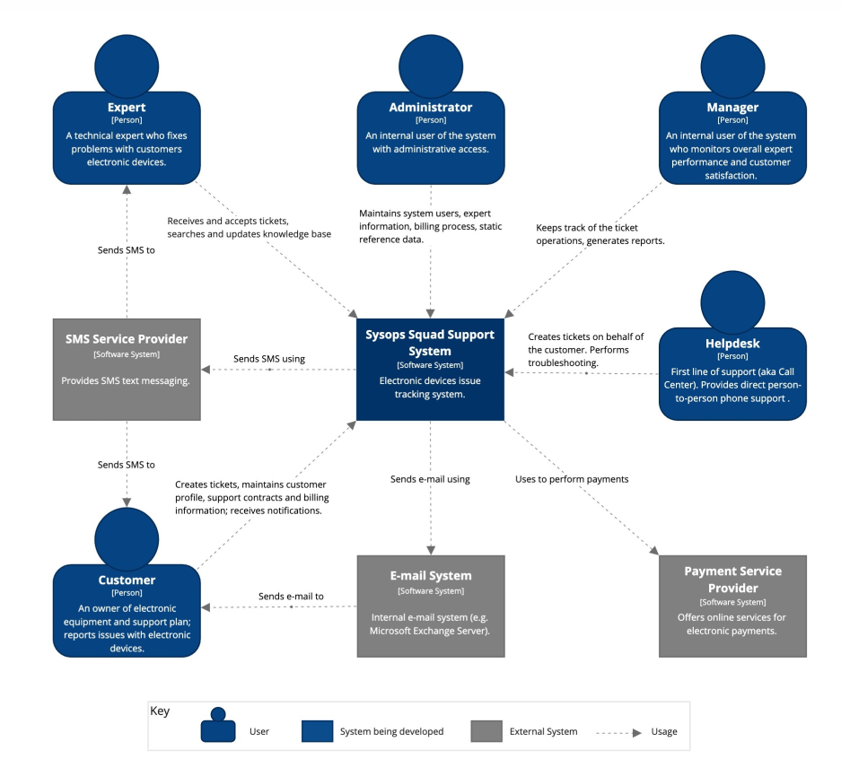
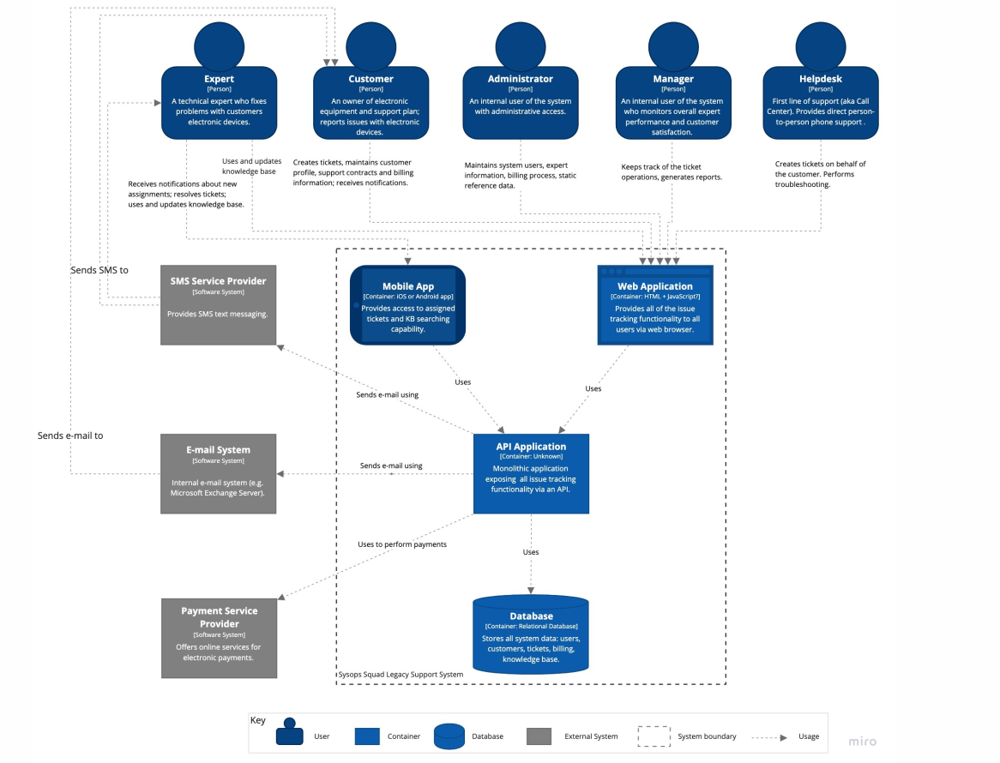

{Заголовок решаемой проблемы/задачи}
=========
|Status:   | {proposed/rejected/accepted/deprecated/superseded by [ADR-0005]}  |
|Deciders: | dev, devops                                                       |
|Date:     | 19.04.2023                                                        |

# Бизнес-цели

Разработать новую систему хелпдеска, которая будет удовлетворять требуемым 
качествам. Компания хочет разработать новую надежную и высокопроизводительную 
систему, которая позволит им остаться в бизнесе и обеспечить будущий рост.

# Бизнес-драйверы

- Текущая система хелпдеска тормозит
- Текущая система хелпдеска не всегда доступна
- Текущая система хелпдеска иногда теряет тикеты или назначает их не на того, специалиста.
- Доработки текущей системы хелпдеска крайне тяжелы.

# Стейкхолдеры и их потребности

Заинтересованные стороны, ключевые участники:

- Администратор - эти люди имеют дело с учетными записями пользователей и 
    биллинговой системой
- Клиент - клиент, который заплатил за услугу 
- Эксперт (сисопс) человек, который исправляет проблему на месте
- Менеджер - есть ли неудовлетворенные клиенты, есть ли заявки, которые не будут 
    назначены экспертом слишком долго, есть ли какие-либо проблемы с 
    выставлением счетов и т. д.
- Служба поддержки - это первая линия поддержки для клиентов, они обеспечивают 
    прямую поддержку по телефону от человека к человеку
- Команда разработки

# Пользовательские истории

UC-1: Пользовательское обслуживание:
- администратор ведет внутренние учетные записи пользователей (клиентов)
- администратор поддерживает экспертный набор навыков, местоположение и 
    доступность

UC-2: Регистрация клиента:
- клиенты регистрируют свой профиль, кредитную карту и план поддержки

UC-3: Воркфлоу заявки:
- клиенты создают заявки на обслуживание через Интернет
- клиенты создают заявки на обслуживание по звонку с помощью техподдержки
- эксперты используют мобильное приложение для чтения заявки и изменения статуса 
    аявки
- эксперты могут осуществлять поиск в базе знаний через мобильное приложение

UC-4: Отправка опроса удовлетворенности:
- клиенты заполняют и отправляют опросы удовлетворенности

# Атрибуты качества

- сервисы и базы знаний, ориентированные на клиентов, должны быть высокодоступными,
    поскольку перебои в работе отрицательно скажутся на бизнесе
- время отклика < 2 с при загрузке страницы
- время поиска в базе знаний несколько секунд
- формирование отчетов не должно занимать чрезмерно много времени
- не должно быть утерянных тикетов
- личная информация клиентов и кредитные карты должны храниться в безопасности и
    соответствовать требованиям PCI

# Контекстная схема системы

# Текущая архитектура

# Критические сценарии

- клиенты создают заявки на обслуживание через Интернет
- клиенты создают заявки на обслуживание по звонку с помощью техподдержки
- эксперты используют мобильное приложение для чтения заявки и изменения статуса
    заявки
- эксперты могут осуществлять поиск в базе знаний через мобильное приложение

# Критические характеристики

- доступность сервисов и базы знаний доля ошибочных ответов от сервиса и базы 
    знаний (можно ориентироваться на 99.9%)
- время ответа сервиса и базы знаний
    + 95% квантелиь времени ответа сервисов для клиента (не должно превышать 3с)
    + 95% квантиель времени ответа поиска в базе знаний (не более 5с)
- надежность: доля утерянных тикетов (не должно быть вообще)
- время разработки (time to market)
- стоимость разработки (budget/cost)

# Архитектурные решения

## Архитектурное решение 1
## Архитектурное решение 2
## Архитектурное решение 3

# Сравнение архитектурных решений

## Удовлетворение базовых сценариев

| Пользовательский сценарий                      |Решение 1|Решение 2|Решение 3|
|------------------------------------------------|---------|---------|---------|
| UC1: заголовок сценария 1                      |    0    |    +    |   ++    |
| UC2: заголовок сценария 2                      |    -    |    0    |   +     |
| UC3: заголовок сценария 3                      |    +    |    --   |    0    |

- *--* - много хуже текущего положения вещей
- *-* - хуже текущего положения вещей
- *0* - на уровне текущего положения вещей
- *+* - лучше текущего положения вещей
- *++* - намного лучше текущего положения вещей

## Удовлетворение критических сценариев

| Пользовательский сценарий                      |Решение 1|Решение 2|Решение 3|
|------------------------------------------------|---------|---------|---------|
| CC1: заголовок критического сценария 1         |    0    |    +    |   ++    |
| CC2: заголовок критического сценария 2         |    -    |    0    |   +     |
| CC3: заголовок критического сценария 3         |    +    |    --   |    0    |

- *--* - много хуже текущего положения вещей
- *-* - хуже текущего положения вещей
- *0* - на уровне текущего положения вещей
- *+* - лучше текущего положения вещей
- *++* - намного лучше текущего положения вещей

## Удовлетворение атрибутов качества

| Атрибуты качества                              |Решение 1|Решение 2|Решение 3|
|------------------------------------------------|---------|---------|---------|
| Атрибут качества 1                             |    0    |    +    |   ++    |
| Атрибут качества 2                             |    -    |    0    |   +     |
| Aтрибут качества 3                             |    +    |    --   |    0    |

- *--* - много хуже                           
- *-* - хуже                          
- *0* - на том же уровне                  
- *+* - лучше                         
- *++* - намного лучше                         

## Удовлетворение критических характеристик

| Критические характеристики                     |Решение 1|Решение 2|Решение 3|
|------------------------------------------------|---------|---------|---------|
| Критическая характеристика 1                   |    0    |    +    |   ++    |
| Критическая характеристика 2                   |    -    |    0    |   +     |
| Критическая характеристика 3                   |    +    |    --   |    0    |

- *--* - много хуже                           
- *-* - хуже                          
- *0* - на том же уровне                  
- *+* - лучше                         
- *++* - намного лучше                         

# Риски архитектурных решений

## Риски архитектурного решения 1
## Риски архитектурного решения 2
## Риски архитектурного решения 3

# Окончательное архитектурное решение
